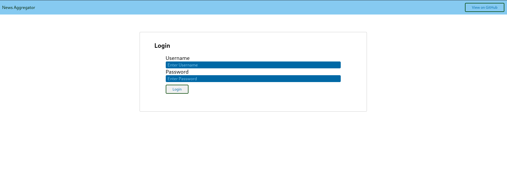
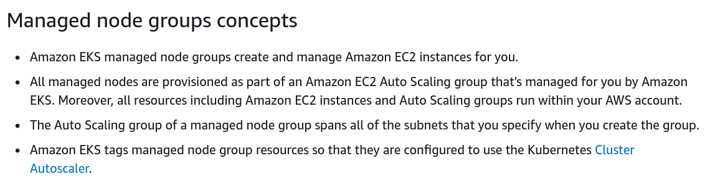
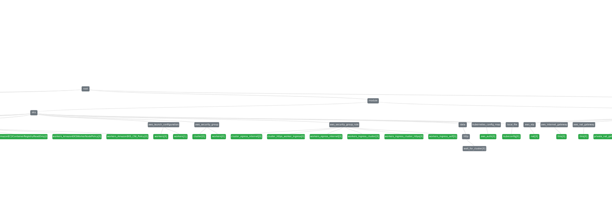

# News Aggregator 

There are 2 microservices:   

## ncollector 
Service to fetch articles via News API and populate the DB.

What it does/provides:
- fetch of news ByCountry (Italy and Australia supported)
- populate sources and domains in the DB
- fetch of news Globally given a set of feeds (domains)


This app is scheduled to run the above mentioned functions every 3 hours.  
There's a limit of 50 API calls every 12h per Dev/Free NEWS API Plan.     

Meaning, if we consume 2 calls for country first (Australia, Italy) we need to set a Max number of feeds to not reach the limit.   
Like:      
| schedule | max calls | max feeds |
|----------|-----------|-----------|
| 6 hours  | 25        | **23**    |
| 3 hours  | 12,5  ~   | **10**    |


## visualizer
Service to provide a web interface for reading records stored in the db.

What it does/provides:  
- search of articles with or without a keyword 
- search of articles per country: Italy, Australia or Global  
- management of Favourite Feeds from the left side menus (config saved in the DB)
- view of number of articles ingested per Favourite Feed on the right side


The app requires authentication. 


If successful, it sets a JWT for the user.   

And that's how it looks like after.     


# Method 1 | Start all with docker-compose

## Setup the Environment 

Register API Key at https://newsapi.org/ to retrieve News   

Then set the following Environment variables:
```
export NEWS_API_KEY="<news-api-key-here>"
export DB_PASSWORD="<postgres-db-password-here>
export JWT_KEY="<jwt-key-here>"
export USER_AUTH="<user-auth-password>"
export DB_HOST="db"
```

The database host variable is required as it's picked up dinamically by the application.   
Needs be set to ```db``` when running docker-compose and to ```localhost``` when running a standalone docker image for postgres (see below).
```
-- with docker-compose
export DB_HOST="db"

-- with docker
export DB_HOST="localhost"
```


## Run docker-compose to spin up the containers
Build
```
sudo docker-compose build --build-arg NEWS_API_KEY="${NEWS_API_KEY}" --build-arg DB_PASSWORD="${DB_PASSWORD}"  --build-arg DB_HOST="${DB_HOST}" --build-arg JWT_KEY="${JWT_KEY}" --build-arg USER_AUTH="${USER_AUTH}"

```
Run
```
sudo docker-compose up
```

## Shutdown Everything 
```
sudo docker-compose down
```

(Optional) If you want to delete the postgres persistent volume as well:
```
sudo docker volume rm news-aggregator_pgdata
```

Done.   
No other steps required.       


# Method 2 | Deploy and Run in GCP/GKE 

First, set the Environment variables as above.  

## Requirements   
- Install ```terraform, google-cloud-sdk (gcloud), kubectl```.       
- Create GCP project and service account within the project
- Link the project to a billing account from GCP console
- Set the  ```GOOGLE_APPLICATION_CREDENTIALS``` env variable for terraform to point to service account credentials 
```
export GOOGLE_APPLICATION_CREDENTIALS="/path/to/my/creds.json"
```

## Create GCP/GKE Resources

Folder ```terraform/gke/```.   

Requires to enable Compute Engine APIs and Kubernetes Engine APIs.
```
gcloud services enable compute.googleapis.com 
gcloud services enable container.googleapis.com

-- list all 
gcloud services list --available
```

**Terraform** plan and apply:
```
terraform plan
terraform apply -auto-approve
```

Get cluster credentials and configure automatically ```kubectl```:
```
-- regional cluster
gcloud container clusters get-credentials $(terraform output -raw kubernetes_cluster_name) --region $(terraform output -raw region)

-- zonal cluster
gcloud container clusters get-credentials $(terraform output -raw kubernetes_cluster_name) --zone $(terraform output -raw zone)
```

## Create Secrets
```
kubectl create secret generic news-secrets --from-literal=apikey="${NEWS_API_KEY}" --from-literal=dbpassword="${DB_PASSWORD}"
```


## Deploy Postgres in GKE

From folder ```k8s/postgres/```.   

Storage Class and Persistent Volume Claim on GCP:
```
kubectl apply -f GCP/postgres-pv.yaml 
```

Then continue:
```
kubectl create configmap pg-initdb --from-file ../../db/CreateTables.sql 
kubectl apply -f postgres-deployment.yaml 
kubectl apply -f postgres-service.yaml
```

Access DB to check.   
```
POD=`kubectl get pods -l app=news-postgres | grep -v NAME | awk '{print $1}'`

kubectl exec -it $POD -- psql -h localhost -p 5432 -U news_db_user -d news -W
```

## Deploy ncollector in GKE

Run ```sudo docker login``` first.    

Then, from folder ```ncollector/```.    
```
sudo docker build -t mesmerai/ncollector .
sudo docker push mesmerai/ncollector
```

Folder ```k8s/ncollector/```.    
```
kubectl apply -f ncollector-deployment.yaml 
kubectl apply -f ncollector-service.yaml
```

## Deploy visualizer in GKE


Folder ```visualizer/```.
```
sudo docker build -t mesmerai/visualizer .
sudo docker push mesmerai/visualizer
```

Folder ```k8s/visualizer/```:
```
kubectl apply -f visualizer-deployment.yaml 
kubectl apply -f visualizer-service.yaml
```

Get the External IP from the Service and browse.   

## Shutdown Everything

Folder ```terraform/gke/```. 
```
terraform destroy -auto-approve
```


# Method 3 | Deploy and Run in AWS/EKS 

First, set the Environment variables as above.  

## Requirements   
- Install ```terraform```
- Install ```aws-cli``` and configure it 
- Install  ```AWS IAM Authenticator``` - https://docs.aws.amazon.com/eks/latest/userguide/install-aws-iam-authenticator.html 
- Install ```kubectl``` and ```wget``` for EKS module    
- Ensure you have permissions required for EKS module - https://github.com/terraform-aws-modules/terraform-aws-eks/blob/master/docs/iam-permissions.md  
- Set the  ```AWS_SHARED_CREDENTIALS_FILE``` env variable for terraform to point to service account credentials 
```
export AWS_SHARED_CREDENTIALS_FILE="/path/to/my/credentials"
```

## Create AWS/EKS Resources

Folder ```terraform/eks/```.   

**Terraform** plan and apply:
```
terraform plan
terraform apply -auto-approve
```

Output (53 resources created):
```
Apply complete! Resources: 53 added, 0 changed, 0 destroyed.
```


Get cluster credentials and configure automatically ```kubectl```:
```
$ aws eks --region $(terraform output -raw region) update-kubeconfig --name $(terraform output -raw cluster_name)
```

If get error like: ```'NoneType' object is not iterable``` delete ```$HOME/.kube/config ``` and try again.


## Create Secrets
```
kubectl create secret generic news-secrets --from-literal=apikey="${NEWS_API_KEY}" --from-literal=dbpassword="${DB_PASSWORD}"
```


## Deploy Postgres in AWS

From folder ```k8s/postgres/```.   

Storage Class and Persistent Volume Claim on AWS:
```
kubectl apply -f AWS/postgres-pv.yaml 
```

Then continue:
```
kubectl create configmap pg-initdb --from-file ../../db/CreateTables.sql 
kubectl apply -f postgres-deployment.yaml 
kubectl apply -f postgres-service.yaml
```

Access DB to check.   
```
POD=`kubectl get pods -l app=news-postgres | grep -v NAME | awk '{print $1}'`

kubectl exec -it $POD -- psql -h localhost -p 5432 -U news_db_user -d news -W
```

## Deploy ncollector in AWS

Run ```sudo docker login``` first.    

Then, from folder ```ncollector/```.    
```
sudo docker build -t mesmerai/ncollector .
sudo docker push mesmerai/ncollector
```

Folder ```k8s/ncollector/```.    
```
kubectl apply -f ncollector-deployment.yaml 
kubectl apply -f ncollector-service.yaml
```

## Deploy visualizer in AWS


Folder ```visualizer/```.
```
sudo docker build -t mesmerai/visualizer .
sudo docker push mesmerai/visualizer
```

Folder ```k8s/visualizer/```:
```
kubectl apply -f visualizer-deployment.yaml 
kubectl apply -f visualizer-service.yaml
```

Get the External IP from the Service and browse at port ```8080```.   

## Shutdown Everything

Folder ```terraform/gke/```. 
```
terraform destroy -auto-approve
```


## Alernative - Start Docker Images Alone

### Postgres Docker Image

Build the image from the ```db/Dockerfile```:
```
sudo docker build -t mesmerai/news-postgres db

```

Run the image passing the POSTGRES_PASSWORD as parameter:

```
sudo docker run --name news-postgres -p 5432:5432 -e POSTGRES_PASSWORD="${DB_PASSWORD}" -d mesmerai/news-postgres
```

Check running docker image:
```
$ sudo docker ps -all
CONTAINER ID   IMAGE                    COMMAND                  CREATED          STATUS          PORTS                    NAMES
1509e02ade12   mesmerai/news-postgres   "docker-entrypoint.s…"   36 seconds ago   Up 35 seconds   0.0.0.0:5432->5432/tcp   news-postgres
```

Connect to DB and check if Tables are created:
```
# psql -h localhost -p 5432 -U news_db_user -d news -W
Password: 
psql (13.4)
Type "help" for help.

-- list tables
news=# \d
                 List of relations
 Schema |      Name      |   Type   |    Owner     
--------+----------------+----------+--------------
 public | article        | table    | news_db_user
 public | article_id_seq | sequence | news_db_user
 public | source         | table    | news_db_user
 public | source_id_seq  | sequence | news_db_user
(4 rows)

```

###  ncollector Docker Image

Build the image from ```ncollector/Dockerfile```:

```
sudo docker build --build-arg NEWS_API_KEY="${NEWS_API_KEY}" --build-arg DB_PASSWORD="${DB_PASSWORD}" -t mesmerai/ncollector ncollector
```

### visualizer Docker Image

Same as ncollector.   


# Dev Takeaways

## Project init
Create ```go.mod```:
```
go mod init github.com/mesmerai/news-aggregator

```

Add module requirements:
```
$ go mod tidy
```

## Data returned from NEWS API request

Each article is an object within the ```articles``` array. 

```
{
  "status": "ok",
  "totalResults": 958,
  "articles": [
    {
      "source": {
        "id": null,
        "name": "tripwire.com"
      },
      "author": null,
      "title": "Clearing Up Elements of Cloud Security",
      "description": "cloud security,brent,people,tripwire cybersecurity podcast,raymond,yeah,elements of cloud,clearing up elements,saas,things,tim erlin,service",
      "url": "https://www.tripwire.com/state-of-security/podcast/clearing-up-elements-of-cloud-security/",
      "urlToImage": "https://www.tripwire.com/state-of-security/wp-content/uploads/sites/3/Talking-Cybersecurity-800x443-1.png",
      "publishedAt": "2021-09-14T03:23:00Z",
      "content": "In this episode, Tripwire’s Brent Holder and Raymond Kirk discuss what cloud security means today. Breaking down the different aspects of cloud security controls, they cover the technology, security … [+16835 chars]"
    },
    {
      "source": {
        "id": null,
        "name": "Seeking Alpha"
      },
```

Useful tool to generate the Go struct from the JSON returned by the request: [JSON-to-GO](https://mholt.github.io/json-to-go/).   
Our ```struct```:      

```
type AutoGenerated struct {
	Status       string `json:"status"`
	TotalResults int    `json:"totalResults"`
	Articles     []struct {
		Source struct {
			ID   interface{} `json:"id"`
			Name string      `json:"name"`
		} `json:"source"`
		Author      interface{} `json:"author"`
		Title       string      `json:"title"`
		Description string      `json:"description"`
		URL         string      `json:"url"`
		URLToImage  string      `json:"urlToImage"`
		PublishedAt time.Time   `json:"publishedAt"`
		Content     string      `json:"content"`
	} `json:"articles"`
}
```

## Project Tagging

Example below:
```
-- tag
git tag -a v0.3 -m 'realease with docker-compose startup'

-- commit (sharing)
git push origin v0.3

-- list tags
git tag -l


```


# Appendix

## Useful Commands 

### Kubernetes

Config
```
-- list config 
kubectl config view

-- delete
kubectl config delete-cluster <cluster-name>
kubectl config delete-context <context-name>
kubectl config delete-user <user-name>
```

Troubleshooting
```
kubectl get pods
kubectl describe pod <pod-name>
kubectl logs <pod-name>
```

Secrets
```
kubectl get secrets
kubectl describe secrets <secret-name>
kubectl get secret <secret-name> -o jsonpath='{.data}'

-- then decode
echo 'zyx123#$%' | base64 --decode

```

### Docker

Containers and Images  
```
-- list containers
sudo docker ps -all
sudo docker container ls -a

-- stop container
sudo docker stop <container-id>  

-- remove container
sudo docker rm <container-id>

-- list images
sudo docker images

-- remove the image
sudo docker rmi <image-id>
``` 

Troubleshooting
```
sudo docker logs <container-id>
sudo docker exec -it <container-id> bash
sudo docker inspect <container-id>
```

Networks
```
sudo docker network ls
sudo docker network prune
```

Volumes
```
-- list
sudo docker volume ls
-- prune
sudo docker volume prune
-- delete volume so postgres will start empty
sudo docker volume rm news-aggregator_pgdata
```


### Docker Compose
```
-- Stops containers and removes containers, networks, volumes, and images created by up
sudo docker-compose down
```

## Install Docker (Fedora 34)

```
# dnf config-manager \
    --add-repo \
    https://download.docker.com/linux/fedora/docker-ce.repo

# dnf install docker-ce docker-ce-cli containerd.io
```

Start Docker (errors and how to fix)
```
-- error running dockerd
failed to start daemon: Error initializing network controller: list bridge addresses failed: PredefinedLocalScopeDefaultNetworks List: [172.17.0.0/16 172.18.0.0/16 172.19.0.0/16 172.20.0.0/16 172.21.0.0/16 172.22.0.0/16 172.23.0.0/16 172.24.0.0/16 172.25.0.0/16 172.26.0.0/16 172.27.0.0/16 172.28.0.0/16 172.29.0.0/16 172.30.0.0/16 172.31.0.0/16 192.168.0.0/20 192.168.16.0/20 192.168.32.0/20 192.168.48.0/20 192.168.64.0/20 192.168.80.0/20 192.168.96.0/20 192.168.112.0/20 192.168.128.0/20 192.168.144.0/20 192.168.160.0/20 192.168.176.0/20 192.168.192.0/20 192.168.208.0/20 192.168.224.0/20 192.168.240.0/20]: no available network

-- fix
# ip link add name docker0 type bridge
# ip addr add dev docker0 172.17.0.1/16
```

Start Docker
```
# systemctl start docker.service

-- enable at boot
# systemctl enable docker.service
```


## Install Postgres (on Fedora 34)

```
# dnf install postgresql-server

-- init
# /usr/bin/postgresql-setup --initdb

-- enable at boot
# systemctl enable postgresql

-- start
# systemctl start postgresql
```

Login
```
$ sudo su - postgres
$ psql
psql (13.4)
Type "help" for help.

postgres=#
```

List Databases
```
postgres-# \l
```

List tables
```
news=# \d
               List of relations
 Schema |      Name      |   Type   |  Owner   
--------+----------------+----------+----------
 public | article        | table    | postgres
 public | article_id_seq | sequence | postgres
 public | source         | table    | postgres
 public | source_id_seq  | sequence | postgres
(4 rows)

```

Describe table 'Articles'
```
news-# \d articles
                                       Table "public.article"
    Column    |          Type          | Collation | Nullable |               Default               
--------------+------------------------+-----------+----------+-------------------------------------
 id           | integer                |           | not null | nextval('article_id_seq'::regclass)
 source_id    | integer                |           |          | 
 author       | character varying(255) |           |          | 
 title        | character varying(255) |           |          | 
 description  | character varying(255) |           |          | 
 url          | character varying(255) |           |          | 
 url_to_image | character varying(255) |           |          | 
 published_at | date                   |           |          | 
 content      | character varying(255) |           |          | 
Indexes:
    "article_pkey" PRIMARY KEY, btree (id)
Foreign-key constraints:
    "article_source_id_fkey" FOREIGN KEY (source_id) REFERENCES source(id)

```

Create user (alias to CREATE ROLE)
```
# CREATE USER db_user WITH PASSWORD '*************';
```
Grant permissions to DB
```
# GRANT ALL PRIVILEGES ON DATABASE news to db_user;
# GRANT CONNECT ON DATABASE news TO db_user;
# GRANT USAGE ON SCHEMA public TO db_user;
```


## K8s Dashboard

Folder ```k8s/dashboard```.   

```
-- create dashboard
kubectl app -f kubernetes-dashboard.yaml 
kubectl proxy

-- create dashboard rbac
kubectl app -f kubernetes-dashboard-admin.rbac.yaml 

-- retrieve secret
kubectl -n kube-system describe secret $(kubectl -n kube-system get secret | grep service-controller-token | awk '{print $1}')

-- access to dashboard  (copy and paste the Token)
http://127.0.0.1:8001/api/v1/namespaces/kubernetes-dashboard/services/https:kubernetes-dashboard:/proxy/
```

## More on AWS/EKS

Includes:
- ECR for container images
- ELB for load distribution
- IAM for authentication
- VPC for isolation

The control plane consists of at least two API server instances and three etcd instances that run across three Availability Zones within a Region.  

Notes.

**Kubernetes Service address range**  
Kubernetes uses a separate address range to allocate IP addresses to internal services within the cluster. This is referred to as Kubernetes service address range. This range must NOT be within the virtual network range and must not be used anywhere else.

**Cluster Endpoint access**
That's the access to k8s API from within the VPC (private) or from outside the VPC (public) or both.   

Meaning ```kubectl``` management access.  

**Autoscaling**
This is a combination of:
- Kubernetes Cluster Autoscaler
- AWS Cloud Implementation (extension to k8s) - integration with AWS services and EC2
- Node groups - A k8s abstration to group of nodes withing a cluster (not a kubernetes thing)
- AWS EC2 Autoscaling Groups - Used by the Cluster Autoscaler in AWS

Managed Nodes in AWS:


Things to find out later:
```
Amazon EKS control plane – Deployed and managed by Amazon EKS in an Amazon EKS managed VPC. When you create the cluster, Amazon EKS creates and manages network interfaces in your account that have Amazon EKS <cluster name> in their description. These network interfaces allow AWS Fargate and Amazon EC2 instances to communicate with the control plane. 
```

To figure out how much is created by Terraform modules and how much is created/managed by AWS managed service.

### Visualize the Terraform Plan
Image generated with graphviz (dot) is scaled down, loses resolutions and it's still big and hard to visualize.

Better tool is Terraform Visual (Online) - https://hieven.github.io/terraform-visual/

```
$ terraform plan -out=plan.out
$ terraform show -json plan.out > plan.json
```

That's the full image generated: 



### Manual Decomposition of Resources

**VPC**
| Resource             |        Name |           ID    |         CIDR |
| -------------------- | ----------- |-----------------|--------------|
| VPC                  | news-vpc    | vpc-09a2bd0d1dc4ece82 |10.0.0.0/16 |

**Subnets**
|  Name                       | ID                         | CIDR         |
|-----------------------------| ---------------------------| -------------|
| news-vpc-public-us-east-2c	| subnet-02bd2f0a90f52e937   | 10.0.6.0/24  |
| news-vpc-public-us-east-2b  | subnet-008cb6f55f4c125cc   | 10.0.5.0/24  |
| news-vpc-public-us-east-2a  | subnet-048b553173bfbdcc6   | 10.0.4.0/24  |
| news-vpc-private-us-east-2c | subnet-056070403aee53551   | 10.0.3.0/24  |
| news-vpc-private-us-east-2b | subnet-040b24051ff560522	 | 10.0.2.0/24  |
| news-vpc-private-us-east-2a | subnet-0a3252783e4305093   | 10.0.1.0/24  |


**Route Tables**

news-vpc-private  
news-vpc-public with IGW  


**Nat GW** 
| NAT ID               | EIP          | Subnet 
|----------------------| -------------| -------------------------
| nat-02caba4de9c249835|3.129.197.238 | subnet-048b553173bfbdcc6 


**Security Groups**  
| Name                            | ID                   | SG Name                                     | Description                 |  Inbound Rules                             |
| --------------------------------| ---------------------| --------------------------------------------| ----------------------------| -------------------------------------------|
| -                               | sg-0e833c56c73edbb78 | default                                     | default VPC security group  | ALL/ALL from sg-0e833c56c73edbb78 / default|
|news-eks-mKjaiFZ4-eks_cluster_sg | sg-0ce5f9964397d0820 | news-eks-mKjaiFZ42021113000043246570000000c | EKS cluster security group.  | HTTPS/443 from sg-01ac430f93e75ffa0 / news-eks-mKjaiFZ42021113000043247970000000d (Allow pods to communicate with the EKS cluster API.)
| eks-cluster-sg-news-eks-mKjaiFZ4-1453404038 | sg-0a7c6931e567e3dbf | eks-cluster-sg-news-eks-mKjaiFZ4-1453404038 | EKS created security group applied to ENI that is attached to EKS Control Plane master nodes, as well as any managed workloads. | ALL/ALL from sg-0a7c6931e567e3dbf / eks-cluster-sg-news-eks-mKjaiFZ4-1453404038
| -                               | sg-069c1576bd9bfc706 | worker_group_mgmt_two20211130000429168500000009 | Managed by Terraform    | SSH/22 From 192.168.0.0/16
| -                               | sg-097275be39e2f37ca | all_worker_management2021113000043230470000000b | Managed by Terraform    | SSH/22 From 10.0.0.0/8, 172.16.0.0/12, 192.168.0.0/16
| -                               | sg-0fca9593452cb8897 | worker_group_mgmt_one2021113000042916950000000a | Managed by Terraform    | SSH/22 From 10.0.0.0/8
| news-eks-mKjaiFZ4-eks_worker_sg | sg-01ac430f93e75ffa0 | news-eks-mKjaiFZ42021113000043247970000000d     | Security group for all nodes in the cluster. | 1) ALL/ALL From sg-01ac430f93e75ffa0 / news-eks-mKjaiFZ42021113000043247970000000d (Allow node to communicate with each other.),   2) HTTPS/443 From sg-0ce5f9964397d0820 / news-eks-mKjaiFZ42021113000043246570000000c (Allow pods running extension API servers on port 443 to receive communication from cluster control plane.),   3)TCP/1025 - 65535 From sg-0ce5f9964397d0820 / news-eks-mKjaiFZ42021113000043246570000000c (Allow workers pods to receive communication from the cluster control plane.)


**EC2 Instances**
|Name             | ID | Subnet | SecurityGroups
|-----------------|----|-------|------------------|
| news-eks-mKjaiFZ4-worker-group-1-eks_asg | 	i-032304c6cb334f4b2 | us-east-2b | news-eks-mKjaiFZ42021113000043247970000000d,worker_group_mgmt_one2021113000042916950000000a
| news-eks-mKjaiFZ4-worker-group-2-eks_asg | 	i-0dca456c06e98d246 | us-east-2b | news-eks-mKjaiFZ42021113000043247970000000d,worker_group_mgmt_two20211130000429168500000009
| news-eks-mKjaiFZ4-worker-group-1-eks_asg | 	i-055ecacc8d3a7e757 | us-east-2c | news-eks-mKjaiFZ42021113000043247970000000d,worker_group_mgmt_one2021113000042916950000000a

**AutoScaling Groups **
| Name        |   Launch Template/config        | Instances | AZs | Subnets
| ------------|---------------------------------| -----------|----|----------
| news-eks-mKjaiFZ4-worker-group-120211130001433340200000017 | news-eks-mKjaiFZ4-worker-group-120211130001425798600000014 | 2 | us-east-2a, us-east-2b, us-east-2c | subnet-056070403aee53551, subnet-040b24051ff560522, subnet-0a3252783e4305093
| news-eks-mKjaiFZ4-worker-group-220211130001433339700000016 | news-eks-mKjaiFZ4-worker-group-220211130001425805000000015 | 1 | us-east-2a, us-east-2b, us-east-2c | subnet-056070403aee53551, subnet-040b24051ff560522, subnet-0a3252783e4305093

**Launch Configurations**
| Name | AMI | SecurityGroups | IAM Instance Profile
|------|-----|---------------|------------------------
|news-eks-mKjaiFZ4-worker-group-120211130001425798600000014 | ami-0c9f07c8fbe372099 | sg-01ac430f93e75ffa0, sg-0fca9593452cb8897 | news-eks-mKjaiFZ42021113000142198550000000f
|news-eks-mKjaiFZ4-worker-group-220211130001425805000000015 | ami-0c9f07c8fbe372099 | sg-01ac430f93e75ffa0, sg-069c1576bd9bfc706  | news-eks-mKjaiFZ42021113000142198550000000f


An EKS cluster consists of several key components

    1. A control plane that runs the Kubernetes software that powers your cluster. See details and adjust settings for the control plane in the cluster Configuration tab.
    2. A data plane made up of Amazon EKS worker nodes (EC2 instances) or Fargate compute. Worker nodes run in your account; Fargate compute runs in AWS accounts.
    All compute (EC2 or Fargate) show up as nodes in the cluster Overview tab. You can manage this compute in the cluster Configuration tab.
    3. Resources that are defined in the Kubernetes API. There are a number of standard resources that define how your code runs on the cluster. You can see common resources and their status in the cluster Workloads tab.
    The EKS console allows you to view, but not modify Kubernetes API resources. You can modify your Kubernetes resources using the kubectl CLI.


# Troubleshooting 

*Error*          
```
2021/09/23 14:10:06 Initiate Connection to DB.
2021/09/23 14:10:06 Error connecting to DB => dial tcp 127.0.0.1:5432: connect: connection refused
```
*Fix*        
Solved by specifying the DB_HOST as env parameter and implementing Retries on DB connection.   
  

*Error*     
```
Error connecting to DB => dial tcp: lookup local on 127.0.0.11:53: no such host
```

*Fix*      
Solved with networks and make sure you pass the build param ```--build-arg DB_HOST=db``` to docker-compose build.


*Error*   

Pod failed with Status ```CrashLoopBackOff```.  
Event ```Back-off restarting failed container```.  
```
-- Pod logs
initdb: error: directory "/var/lib/postgresql/data" exists but is not empty
It contains a lost+found directory, perhaps due to it being a mount point.
Using a mount point directly as the data directory is not recommended.
Create a subdirectory under the mount point.
```

*Fix*   
Solved by assigning PGDATA value different than mount point.   

## Terraform

*Error*
```
module.vpc.aws_subnet.public[0]: Still destroying... [id=subnet-061fdeb63f640daf2, 19m50s elapsed]
module.vpc.aws_subnet.public[1]: Still destroying... [id=subnet-098741829eeeca635, 20m0s elapsed]
module.vpc.aws_subnet.public[0]: Still destroying... [id=subnet-061fdeb63f640daf2, 20m0s elapsed]
╷
│ Error: error detaching EC2 Internet Gateway (igw-06ce1e47d880268e8) from VPC (vpc-0f14e1f42cae8f809): DependencyViolation: Network vpc-0f14e1f42cae8f809 has some mapped public address(es). Please unmap those public address(es) before detaching the gateway.
│ 	status code: 400, request id: d14b1da2-0464-4cd7-929b-49d3a2995499
│ 

│ Error: error deleting subnet (subnet-098741829eeeca635): timeout while waiting for state to become 'destroyed' (last state: 'pending', timeout: 20m0s)
│ 

╷
│ Error: error deleting subnet (subnet-061fdeb63f640daf2): timeout while waiting for state to become 'destroyed' (last state: 'pending', timeout: 20m0s)
│ 
```

*Fix*   
Manually delete the ELB.

Then, error:
```
│ Error: Error deleting VPC: DependencyViolation: The vpc 'vpc-0f14e1f42cae8f809' has dependencies and cannot be deleted.
│ 	status code: 400, request id: ee224235-fd06-410b-b73e-ed16f72c0696
│ 
```

Then,
manually delete the VPC.


Need to test, investigate more (eventually test it with T3 instances).

